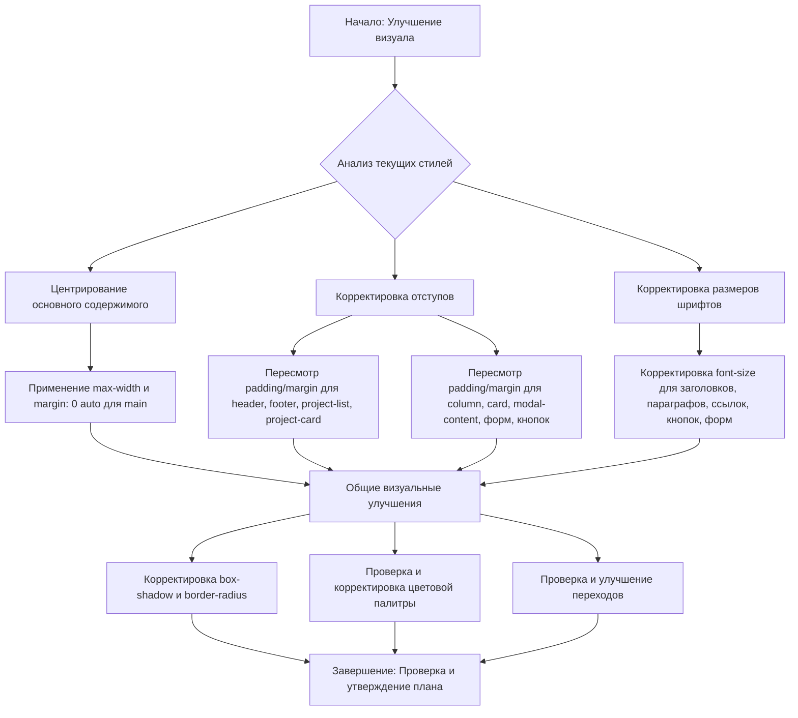

### План действий по улучшению визуала и центрированию:

1.  **Центрирование основного содержимого страницы:**
    *   Добавить стили к элементу `<main>`, чтобы ограничить его ширину и центрировать по горизонтали. Это обеспечит, что весь контент будет выглядеть аккуратно выровненным.

2.  **Улучшение отступов:**
    *   Пересмотреть и скорректировать значения `padding` и `margin` для всех ключевых элементов интерфейса. Это включает:
        *   `header` и `footer` для лучшего распределения пространства.
        *   `.project-list` и `.project-card` для более гармоничного расположения карточек проектов.
        *   `.column` и `.card` для улучшения внешнего вида канбан-доски.
        *   `.modal-content`, формы (`input`, `textarea`, `select`) и кнопки для более приятного взаимодействия с модальными окнами.
    *   Цель — создать единообразные и визуально сбалансированные отступы, которые улучшат читаемость и общую эстетику.

3.  **Улучшение размеров шрифтов для лучшей читаемости:**
    *   Проанализировать текущие размеры шрифтов (`font-size`) для всех текстовых элементов:
        *   Заголовки (`h1`, `h2`, `h3`, `h4`) для четкой иерархии.
        *   Параграфы (`p`) для комфортного чтения основного текста.
        *   Ссылки (`a`), кнопки (`button`) и элементы форм для улучшения их восприятия.
    *   Скорректировать их, чтобы обеспечить оптимальную читаемость на разных устройствах и улучшить визуальную иерархию информации.

4.  **Общие визуальные улучшения (на основе "неаккуратно" и "более приятным"):**
    *   Проверить и, при необходимости, скорректировать `box-shadow` (тени) и `border-radius` (скругление углов) для всех интерактивных и контейнерных элементов, таких как карточки проектов, колонки и модальные окна. Цель — сделать их более "мягкими" и современными.
    *   Убедиться, что текущая цветовая палитра (фоны, текст, акцентные цвета) гармонична и приятна для глаз. Возможно, потребуется небольшая корректировка существующих цветов для создания более "приятного" визуала.
    *   Проверить наличие и выраженность переходов (`transition`) для интерактивных элементов (кнопки, карточки при наведении), чтобы добавить плавности в пользовательский опыт.

### Визуализация плана (Mermaid диаграмма):



### Предлагаемые изменения в `frontend/style.css` (примеры):

*   **Для центрирования основного содержимого:**
    ```css
    main {
        max-width: 1200px; /* Пример максимальной ширины */
        margin: 0 auto; /* Центрирование по горизонтали */
        padding: 2rem; /* Сохранить или скорректировать отступы */
    }
    ```
*   **Для отступов и размеров шрифтов:**
    *   Будет произведен детальный анализ каждого элемента и его текущих стилей для точной корректировки. Например, для `.project-card` могут быть изменены `padding` и `font-size` заголовков и текста.
*   **Для общего улучшения визуала:**
    *   Значения `box-shadow` и `border-radius` будут скорректированы для придания более современного и "мягкого" вида.