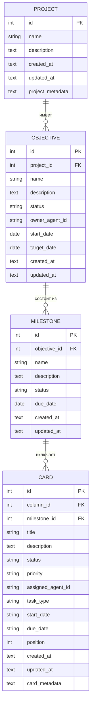

# План реализации иерархии "Цель -> Этап -> Задача"

## 1. Создание новых моделей данных:

*   Создать файл `backend/models/objective.py` для модели `Objective` со следующими полями: `id`, `project_id` (FK к Project), `name`, `description`, `status`, `owner_agent_id`, `start_date`, `target_date`, `created_at`, `updated_at`.
*   Создать файл `backend/models/milestone.py` для модели `Milestone` со следующими полями: `id`, `objective_id` (FK к Objective), `name`, `description`, `status`, `due_date`, `created_at`, `updated_at`.
*   Добавить отношения `db.relationship` в `Project` для `Objective` и в `Objective` для `Milestone`.

## 2. Модификация существующей модели данных:

*   Добавить поле `milestone_id` (FK к Milestone, nullable=True) в модель `Card` в файле `backend/models/card.py`.

## 3. Создание новых сервисов:

*   Создать файл `backend/services/objective_service.py` с классами и методами для CRUD-операций над `Objective`.
*   Создать файл `backend/services/milestone_service.py` с классами и методами для CRUD-операций над `Milestone`.

## 4. Создание новых API-эндпоинтов:

*   Создать файл `backend/api/objectives.py` с блюпринтом и эндпоинтами для `Objective`:
    *   `POST /projects/<project_id>/objectives`
    *   `GET /projects/<project_id>/objectives`
    *   `GET /objectives/<objective_id>`
    *   `PUT /objectives/<objective_id>`
    *   `DELETE /objectives/<objective_id>`
*   Создать файл `backend/api/milestones.py` с блюпринтом и эндпоинтами для `Milestone`:
    *   `POST /objectives/<objective_id>/milestones`
    *   `GET /milestones/<milestone_id>`
    *   `PUT /milestones/<milestone_id>`
    *   `DELETE /milestones/<milestone_id>`
*   Зарегистрировать новые блюпринты (`objectives_bp`, `milestones_bp`) в `backend/app.py`.

## 5. Обновление существующих API-эндпоинтов и сервисов:

*   Модифицировать эндпоинты `Card` в `backend/api/cards.py` и методы в `backend/services/card_service.py` для поддержки поля `milestone_id` при создании и обновлении карточек.

## 6. Реализация бизнес-логики автоматического обновления статусов:

*   В `CardService` (или в новом модуле, если потребуется более сложная логика) добавить метод, который при изменении статуса `Card` на 'completed' будет проверять все задачи для связанного `milestone_id`. Если все задачи завершены, автоматически обновлять статус `Milestone` на 'completed'.
*   В `MilestoneService` добавить метод, который при изменении статуса `Milestone` на 'completed' будет проверять все этапы для связанного `objective_id`. Если все этапы завершены, автоматически обновлять статус `Objective` на 'completed'.

## 7. Обновление `__init__.py` файлов:

*   Добавить импорты новых моделей (`Objective`, `Milestone`) в `backend/models/__init__.py`.
*   Добавить импорты новых сервисов (`ObjectiveService`, `MilestoneService`) в `backend/services/__init__.py`.
*   Добавить импорты новых API блюпринтов (`objectives_bp`, `milestones_bp`) в `backend/api/__init__.py`.

## 8. Обновление `database.py`:

*   Убедиться, что функция `init_db` в `backend/database.py` корректно создает новые таблицы при вызове `db.create_all()`.

### Диаграмма концептуальной модели:



### Диаграмма архитектуры API:

```mermaid
graph TD
    subgraph Backend
        A[Flask App] --> B(API Blueprints)
        B --> C{/api/v1/projects}
        B --> D{/api/v1/columns}
        B --> E{/api/v1/cards}
        B --> F{/api/v1/objectives}
        B --> G{/api/v1/milestones}

        C --> H[ProjectService]
        D --> I[ColumnService]
        E --> J[CardService]
        F --> K[ObjectiveService]
        G --> L[MilestoneService]

        H --> M(Database)
        I --> M
        J --> M
        K --> M
        L --> M
    end

    subgraph Database
        M --> N(Project Table)
        M --> O(Objective Table)
        M --> P(Milestone Table)
        M --> Q(Card Table)
        M --> R(Column Table)
        M --> S(Board Table)
        M --> T(History Table)
    end

    subgraph Frontend
        U[React App] --> V(API Calls)
        V --> C
        V --> D
        V --> E
        V --> F
        V --> G
    end

    style F fill:#f9f,stroke:#333,stroke-width:2px
    style G fill:#f9f,stroke:#333,stroke-width:2px
    style K fill:#f9f,stroke:#333,stroke-width:2px
    style L fill:#f9f,stroke:#333,stroke-width:2px
    style O fill:#f9f,stroke:#333,stroke-width:2px
    style P fill:#f9f,stroke:#333,stroke-width:2px