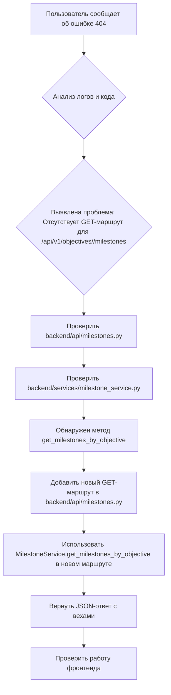

# План по устранению ошибки "Ошибка при открытии roadmap" (404 NOT FOUND)

## Описание проблемы
При попытке открыть "roadmap" возникает ошибка 404 (NOT FOUND) при запросе к эндпоинту `http://localhost:5000/api/v1/objectives/<objective_id>/milestones`. Это указывает на то, что бэкенд не может найти соответствующий маршрут для получения списка вех (milestones) для конкретной цели (objective).

## Анализ
1.  **Файлы бэкенда:**
    *   `backend/api/objectives.py`: Содержит маршруты для целей. Маршрут `/projects/<int:project_id>/objectives` (GET) и `/objectives/<int:objective_id>` (GET) уже вкладывают вехи, используя `MilestoneService.get_milestones_by_objective`.
    *   `backend/api/milestones.py`: Содержит маршруты для вех. Присутствует маршрут POST для создания вехи (`/objectives/<int:objective_id>/milestones`) и GET для получения одной вехи (`/milestones/<int:milestone_id>`). **Отсутствует GET-маршрут для получения списка вех по `objective_id`.**
    *   `backend/services/milestone_service.py`: Содержит метод `get_milestones_by_objective(objective_id)`, который корректно извлекает вехи из базы данных по ID цели.
    *   `backend/app.py`: Регистрирует блюпринты, что означает, что новые маршруты, добавленные в `milestones.py`, будут доступны.

2.  **Вывод:**
    Основная причина ошибки 404 заключается в отсутствии GET-маршрута `/api/v1/objectives/<int:objective_id>/milestones` в `backend/api/milestones.py`. Фронтенд пытается обратиться к этому эндпоинту, но бэкенд его не предоставляет.

## План действий



## Детали реализации

Будет добавлен следующий код в файл [`backend/api/milestones.py`](backend/api/milestones.py):

```python
@milestones_bp.route('/objectives/<int:objective_id>/milestones', methods=['GET'])
def get_milestones_for_objective(objective_id):
    """Получает список этапов для указанной цели.

    Args:
        objective_id (int): ID цели.

    Returns:
        flask.Response: JSON-ответ, содержащий список этапов.
    """
    milestones = MilestoneService.get_milestones_by_objective(objective_id)
    return jsonify([m.to_dict() for m in milestones])
```

Этот маршрут позволит фронтенду успешно запрашивать вехи для конкретной цели, устраняя ошибку 404.